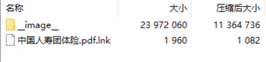
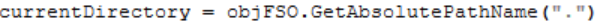
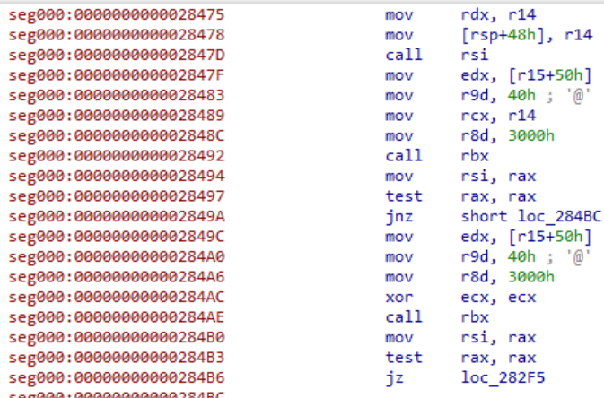
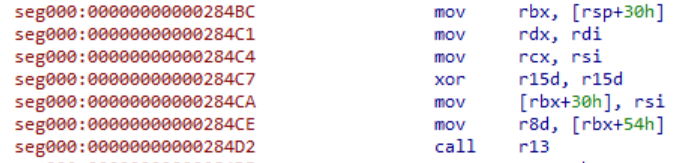
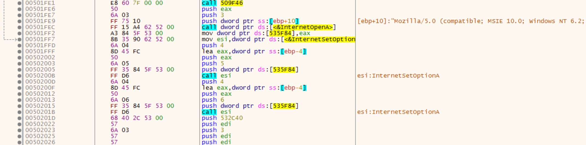

# PDF钓鱼木马


## 一、基本信息

```
HASH：
f42201b5d890a96302f90102b16d7c31cfcc3b67c801ba7c6f6be223f16d7011
```

流程很简单，使用的C2也感觉是拿CS生成的，使用针对CS的YARA规则可以被检查出来。免杀手法也只有白加黑，Python Loader，没有对某种杀软作专门的适配，没有对痕迹进行清理等操作，不像是针对性攻击。

## 二、执行流程

其包含一个隐藏文件夹，快捷方式指向的是vbs脚本



vbs脚本会获取当前路径，获取后执行白加黑



随后直接就是Loader执行了

```python
WshShell.Run Chr(34) & programPath & Chr(34) & " " & Chr(34) & arguments & Chr(34), 0, False
```

白程序为之前LockBit使用过的VMwareXferlogs.exe，其Loader为Python程序，使用的RC4加密，并且shellcode使用的SMC技术，会先申请内存



然后将数据写入申请的内存



然后修复为PE文件执行，其远控感觉为CS生成的……执行流程感觉差不多，都是先对IP地址解密，然后建立链接



dump出的内容拿检测CS的yara规则也能匹配上……

